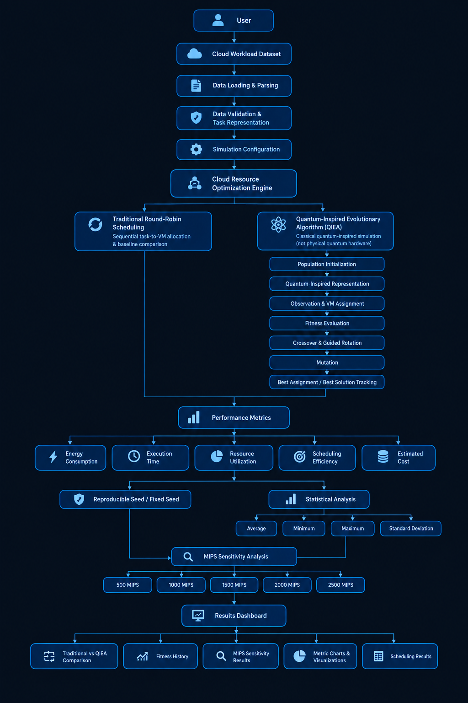
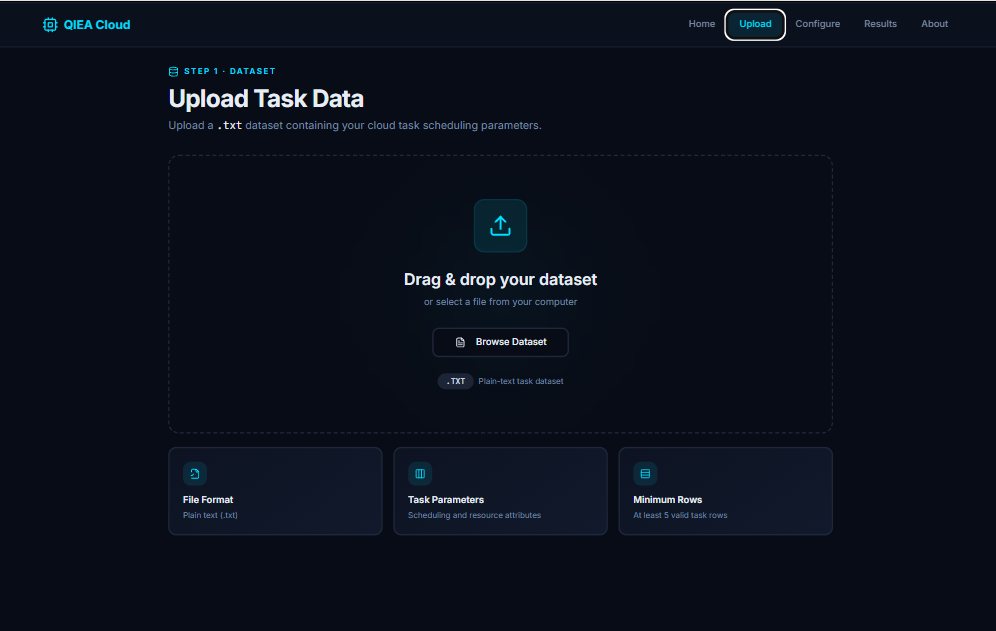
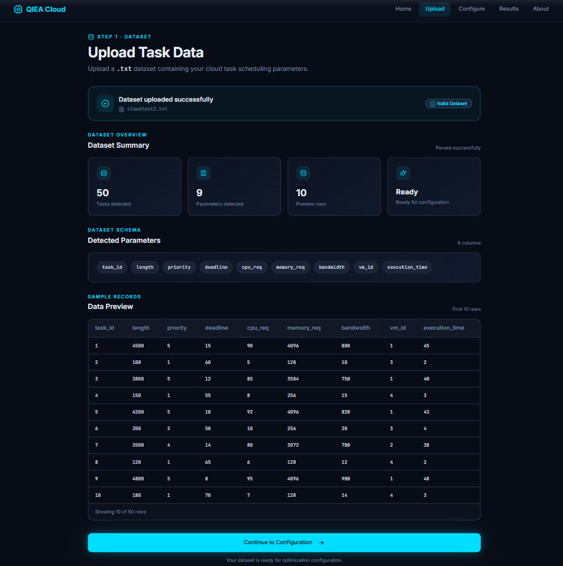
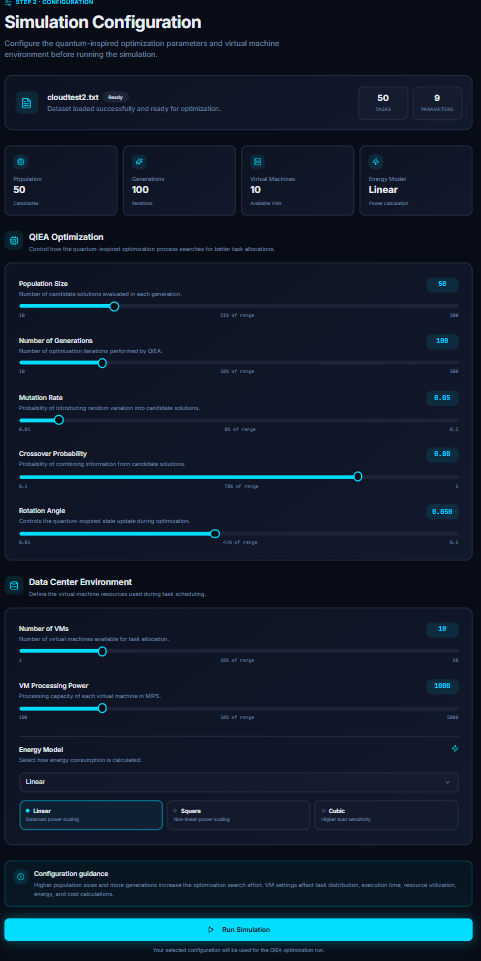
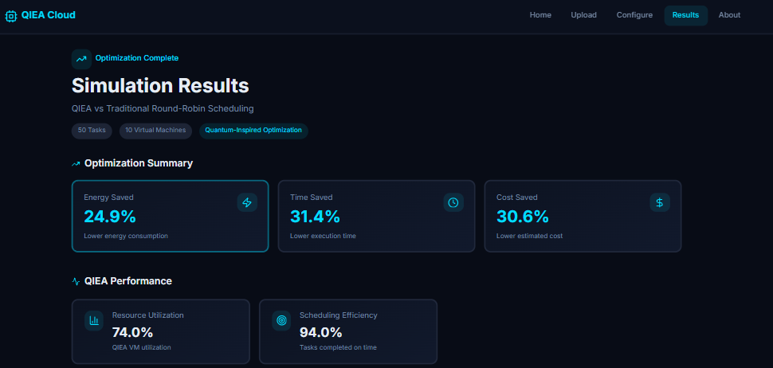
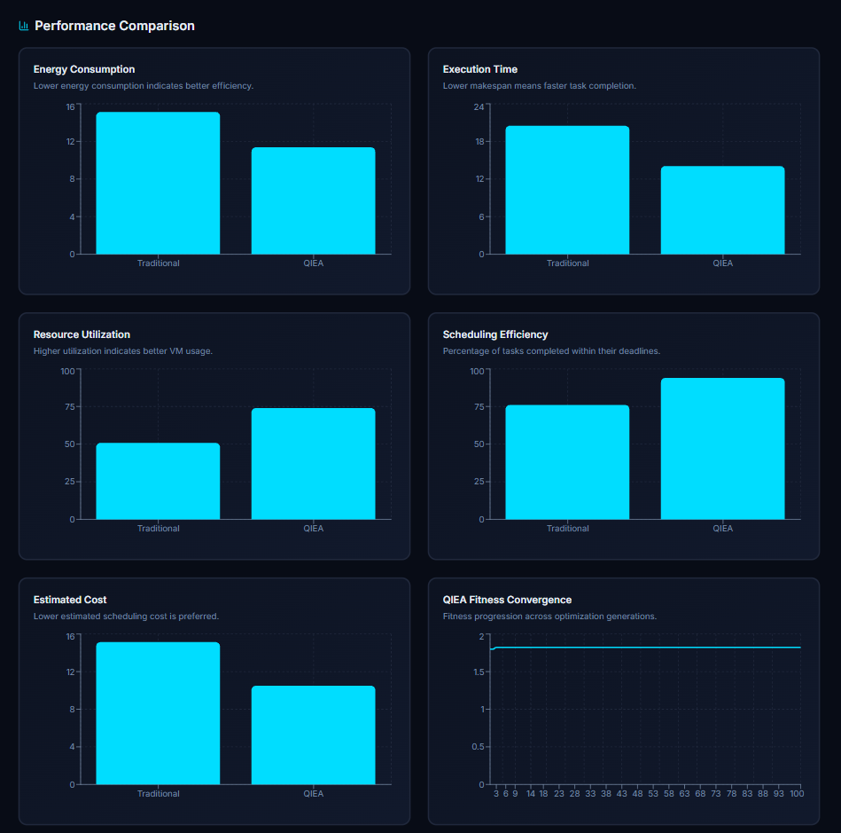
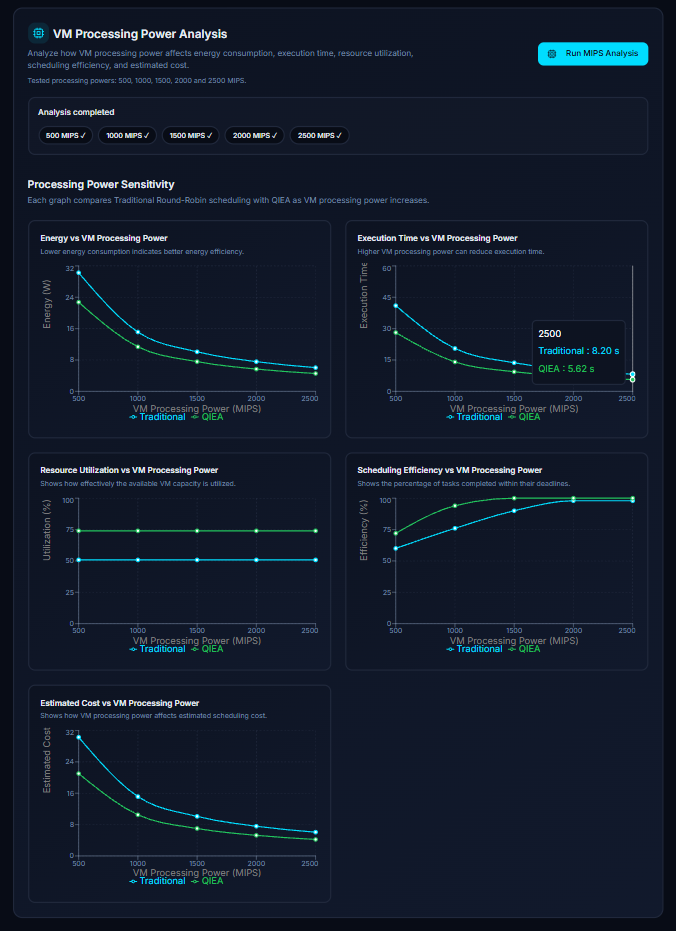
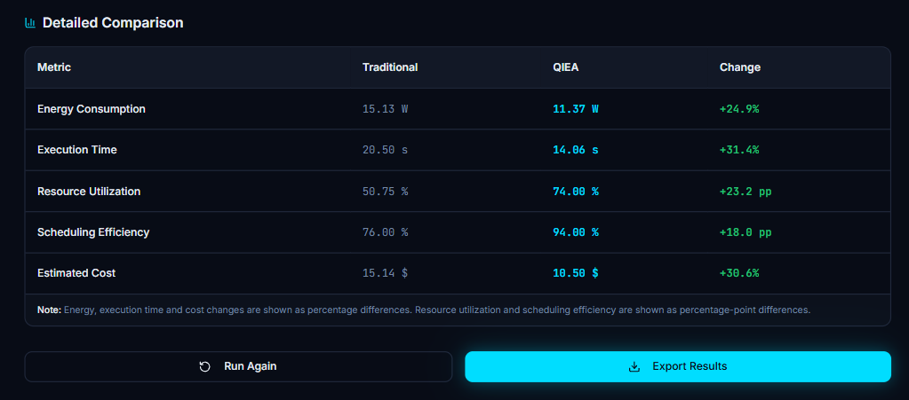

# ☁️⚛️ Quantum-Inspired Cloud Resource Allocation Optimization

### 🧠 Quantum-Inspired Optimization for Efficient Cloud Resource Scheduling

A web-based cloud resource allocation and scheduling optimization system that compares a traditional **Round-Robin scheduling approach** with a **Quantum-Inspired Evolutionary Algorithm (QIEA)** using multiple performance metrics.

The application provides an interactive workflow for uploading workload data, configuring simulation parameters, running scheduling simulations, comparing results, and analyzing the effect of VM processing power through **MIPS Sensitivity Analysis**.

> **Important:** QIEA in this project is implemented using classical computation. It is a **quantum-inspired optimization approach**, not execution on physical quantum hardware.

---

## 📑 Table of Contents

 [Overview](#-1-overview)
 [Problem Statement](#-2-problem-statement)
 [Motivation](#-3-motivation)
 [Objectives](#-4-objectives)
 [Core Features](#-5-core-features)
 [Technology Stack](#-6-technology-stack)
 [System Architecture](#-7-system-architecture)
 [Architecture Explanation](#-8-architecture-explanation)
 [Dataset](#-9-dataset)
 [Dataset Schema](#-10-dataset-schema)
 [Data Processing](#-11-data-processing)
 [Simulation and Optimization Logic](#-12-simulation-and-optimization-logic)
 [Traditional Scheduling](#-13-traditional-scheduling)
 [Quantum-Inspired Evolutionary Algorithm](#-14-quantum-inspired-evolutionary-algorithm)
 [Scheduling Factors](#-15-scheduling-factors)
 [Optimization Objectives](#-16-optimization-objectives)
 [Performance Metrics](#-17-performance-metrics)
 [Reproducible Benchmarking](#-18-reproducible-benchmarking)
 [MIPS Sensitivity Analysis](#-19-mips-sensitivity-analysis)
 [System Workflow](#-20-system-workflow)
 [Application Modules](#-21-application-modules)
 [Results and Visualization](#-22-results-and-visualization)
 [Application Screenshots](#-23-application-screenshots)
 [Project Structure](#-24-project-structure)
 [Getting Started](#-25-getting-started)
 [Prerequisites & Installation](#-26-prerequisites--installation)
 [Running, Building & Previewing](#-27-running-building--previewing)
 [Testing & Linting](#-28-testing--linting)
 [How the Application Works](#-29-how-the-application-works)
 [Key Capabilities & Project Goals](#-30-key-capabilities--project-goals)
 [Future Enhancements, Technical Notes & Limitations](#-31-future-enhancements-technical-notes--limitations)
 [Disclaimer, Author, Connect & License](#-32-disclaimer-author-connect--license)

---

# 🚀 Overview

**Quantum-Inspired Cloud Resource Allocation Optimization** is an interactive web application developed to study intelligent cloud task scheduling and resource allocation.

The system allows users to upload workload data, configure virtual machines, execute scheduling simulations, compare different scheduling approaches, and visualize performance metrics.

The project compares:

- **Traditional Round-Robin Scheduling**
- **Quantum-Inspired Evolutionary Algorithm (QIEA)**

The system evaluates scheduling performance using:

- Energy Consumption
- Execution Time
- Resource Utilization
- Scheduling Efficiency
- Estimated Cost

It also provides **MIPS Sensitivity Analysis** to study how changes in VM processing power affect scheduling performance.

The project is designed primarily for **academic experimentation, simulation, visualization, and learning**.

---

# 🎯 Problem Statement

Cloud computing environments must efficiently distribute computational tasks across available virtual machines.

Inefficient task allocation can result in:

- Higher energy consumption
- Increased execution time
- Poor resource utilization
- Lower scheduling efficiency
- Higher simulated resource cost

Traditional scheduling methods such as Round-Robin distribute tasks in a simple sequential manner. However, they do not explicitly search for allocations that balance multiple performance objectives.

This project explores a **Quantum-Inspired Evolutionary Algorithm** as an optimization approach for finding alternative task-to-VM allocations in a simulated cloud environment.

The system provides a common platform for comparing the baseline and optimization approaches under the same workload and configuration.

---

# 💡 Motivation

Cloud resource scheduling is an important problem because the same workload can produce different performance results depending on how tasks are assigned to virtual machines.

The motivation behind this project is to explore whether an evolutionary optimization approach can provide useful alternative schedules while considering multiple performance factors.

Instead of evaluating a schedule using only one metric, the system combines:

> **Energy + Execution Time + Resource Utilization + Scheduling Efficiency + Estimated Cost**

The interactive dashboard makes it possible to experiment with different VM configurations and optimization parameters and observe their effect on scheduling results.

---

# 🎯 Objectives

The major objectives of the project are:

- Develop an interactive cloud scheduling simulation platform.
- Implement a traditional Round-Robin scheduling approach.
- Implement a Quantum-Inspired Evolutionary Algorithm.
- Compare the two approaches using common performance metrics.
- Provide configurable VM and optimization parameters.
- Analyze the effect of VM processing capacity.
- Implement MIPS sensitivity analysis.
- Provide deterministic simulation behavior.
- Visualize optimization progress using fitness history.
- Present results using charts, tables, and metric cards.
- Provide an accessible academic demonstration of quantum-inspired optimization.

---

# ✨ Core Features

## 📂 Workload Upload

Users can upload workload data through the application interface.

The uploaded workload is parsed and validated before being passed to the scheduling engine.

## ⚙️ Simulation Configuration

Users can configure parameters such as:

- Population Size
- Number of Generations
- Mutation Rate
- Crossover Probability
- Rotation Angle
- Number of VMs
- VM MIPS
- Energy Model

## 🔄 Traditional Scheduling

The system uses **Round-Robin** as the traditional scheduling baseline.

## ⚛️ Quantum-Inspired Optimization

The system implements a classical Quantum-Inspired Evolutionary Algorithm for exploring candidate task allocations.

## 📊 Performance Comparison

The application compares scheduling results using:

- Energy
- Execution Time
- Resource Utilization
- Scheduling Efficiency
- Estimated Cost

## 📈 Fitness Visualization

The Results page displays the evolution of the best fitness value across generations.

## 🖥️ MIPS Sensitivity Analysis

The application evaluates VM processing capacity at:

- 500 MIPS
- 1000 MIPS
- 1500 MIPS
- 2000 MIPS
- 2500 MIPS

---

# 🛠️  Technology Stack

| Technology | Purpose |
|---|---|
| React | Frontend user interface |
| TypeScript | Application logic and type safety |
| Vite | Development server and build tool |
| Tailwind CSS / CSS | Interface styling |
| npm | Dependency management |
| Browser APIs | Client-side application execution |
| Structured Workload Data | Scheduling input |
| ESLint | Code quality and linting |
| Modern Web Browser | Application runtime |

---

# 🏗️  System Architecture

The application follows a modular simulation architecture.



### Architecture Flow

```text
                         ┌───────────────────────┐
                         │      User / Admin     │
                         └───────────┬───────────┘
                                     │
                                     ▼
                         ┌───────────────────────┐
                         │     Web Interface     │
                         │   React + TypeScript   │
                         └───────────┬───────────┘
                                     │
                   ┌─────────────────┴─────────────────┐
                   │                                   │
                   ▼                                   ▼
         ┌───────────────────┐               ┌───────────────────┐
         │  Workload Upload  │               │   Configuration   │
         │ Parsing & Valid.  │               │ Simulation Params │
         └─────────┬─────────┘               └─────────┬─────────┘
                   │                                   │
                   └─────────────────┬─────────────────┘
                                     ▼
                         ┌───────────────────────┐
                         │   Simulation Engine   │
                         │    simulation.ts      │
                         └───────────┬───────────┘
                                     │
                       ┌─────────────┴─────────────┐
                       │                           │
                       ▼                           ▼
             ┌──────────────────┐       ┌─────────────────────┐
             │   Round-Robin    │       │  Quantum-Inspired   │
             │    Scheduler     │       │ Evolutionary Algo.  │
             └────────┬─────────┘       └──────────┬──────────┘
                      │                            │
                      └─────────────┬──────────────┘
                                    ▼
                         ┌───────────────────────┐
                         │ Performance Evaluation│
                         │ Energy / Time / Util. │
                         │ Efficiency / Cost     │
                         └───────────┬───────────┘
                                     │
                                     ▼
                         ┌───────────────────────┐
                         │  MIPS Sensitivity     │
                         │   500 → 2500 MIPS     │
                         └───────────┬───────────┘
                                     │
                                     ▼
                         ┌───────────────────────┐
                         │   Results Dashboard   │
                         │ Charts + Tables +     │
                         │ Fitness Visualization │
                         └───────────────────────┘
```

---

# 🔎  Architecture Explanation

The application follows a modular simulation architecture where workload input, configuration, scheduling, optimization, evaluation, and visualization are handled as separate stages.

### Architecture Flow

```text
User
 │
 ▼
┌───────────────────────────────┐
│      1. User Interface        │
│      React + TypeScript       │
└───────────────┬───────────────┘
                │
                ▼
┌───────────────────────────────┐
│       2. Workload Input       │
│   Upload structured workload  │
└───────────────┬───────────────┘
                │
                ▼
┌───────────────────────────────┐
│      3. Data Processing       │
│    Parse + Validate Dataset   │
└───────────────┬───────────────┘
                │
                ▼
┌───────────────────────────────┐
│       4. Configuration        │
│ VM + Optimization Parameters  │
└───────────────┬───────────────┘
                │
                ▼
┌───────────────────────────────┐
│      5. Simulation Engine     │
│        simulation.ts          │
└───────────────┬───────────────┘
                │
        ┌───────┴────────┐
        │                │
        ▼                ▼
┌───────────────┐  ┌────────────────────────┐
│ 6. Traditional│  │ 7. Quantum-Inspired   │
│   Scheduler   │  │ Evolutionary Algorithm│
│  Round-Robin  │  │        QIEA            │
└───────┬───────┘  └───────────┬────────────┘
        │                       │
        └──────────┬────────────┘
                   ▼
┌────────────────────────────────┐
│     8. Performance Evaluation  │
│ Energy / Time / Utilization    │
│ Efficiency / Estimated Cost    │
└───────────────┬────────────────┘
                │
                ▼
┌────────────────────────────────┐
│     9. MIPS Sensitivity        │
│ 500 → 1000 → 1500 → 2000 → 2500│
└───────────────┬────────────────┘
                │
                ▼
┌────────────────────────────────┐
│       10. Results Dashboard     │
│ Charts + Tables + Fitness       │
│ History + MIPS Analysis         │
└────────────────────────────────┘
```

### Detailed Architecture Components

#### 1. User Interface

The React and TypeScript frontend provides the complete interaction layer for the application.

#### 2. Workload Input

The user uploads structured workload information through the Upload Page.

#### 3. Data Processing

The uploaded workload is parsed, validated, and converted into the internal representation required by the simulation engine.

#### 4. Configuration

The user specifies VM and optimization parameters such as VM count, MIPS, population size, generations, mutation rate, crossover probability, rotation angle, and energy model.

#### 5. Simulation Engine

The simulation engine executes both scheduling approaches using the selected workload and configuration.

#### 6. Traditional Scheduler

Round-Robin generates the baseline task allocation by distributing tasks sequentially across the available virtual machines.

#### 7. QIEA

The Quantum-Inspired Evolutionary Algorithm generates and evolves candidate task allocations using classical computation inspired by quantum evolutionary concepts.

#### 8. Performance Evaluation

Both schedules are evaluated using the same performance metrics so that the results can be compared under the same experimental configuration.

#### 9. Sensitivity Analysis

The simulation can be repeated at different MIPS values to study the effect of VM processing capacity.

#### 10. Results Dashboard

The final results are presented through charts, tables, metric cards, fitness-history visualization, and MIPS sensitivity analysis.

---

# 📁 Dataset

The project uses structured workload data as input to the scheduling simulation.

The workload represents computational tasks that need to be assigned to virtual machines.

The application is designed to accept workload data rather than depending on a single fixed external dataset.

This makes it possible to experiment with different workload configurations without changing the scheduling algorithms.

> **Note:** The uploaded workload is treated as simulation input. The project does not claim to depend on a single standardized external cloud benchmark dataset.

---

# 🧾 Dataset Schema

The workload parser converts uploaded data into the internal representation required by the simulation engine.

Conceptually, the input contains task-related information such as:

```text
Workload Dataset
       │
       ├── Task Information
       │
       ├── Computational Workload
       │
       └── Scheduling-Related Values
```

The exact input format is interpreted by the project's workload parser.

The parser performs format detection and validation before the workload is passed to the scheduling engine.

---

# 🔄 Data Processing

The workload processing pipeline is:

```text
Upload Workload
      ↓
Read File
      ↓
Detect Data Format
      ↓
Parse Rows
      ↓
Validate Input
      ↓
Convert to Simulation Representation
      ↓
Pass to Scheduling Engine
```

### Processing Responsibilities

- Read uploaded workload data.
- Detect supported delimiters.
- Parse workload rows.
- Validate the workload.
- Check whether sufficient data is available.
- Convert the data into the internal simulation representation.
- Pass the processed workload to the scheduling engine.

---

# 🧬 Simulation and Optimization Logic

The simulation follows a common workflow for both scheduling approaches.

```text
Input Workload
      ↓
Create VM Configuration
      ↓
Generate Traditional Schedule
      ↓
Generate Initial QIEA Population
      ↓
Evaluate Fitness
      ↓
Selection
      ↓
Crossover
      ↓
Quantum-Inspired Rotation
      ↓
Mutation
      ↓
Evaluate New Population
      ↓
Track Best Solution
      ↓
Calculate Performance Metrics
      ↓
Compare Results
```

The same workload and relevant VM configuration are used when comparing the scheduling approaches so that the results remain comparable.

---

# 🔁 Traditional Scheduling

The traditional scheduling approach used in this project is **Round-Robin**.

Tasks are assigned sequentially across the available virtual machines.

### Example

```text
Task 1 → VM 1
Task 2 → VM 2
Task 3 → VM 3
Task 4 → VM 4
Task 5 → VM 1
Task 6 → VM 2
Task 7 → VM 3
Task 8 → VM 4
```

### Characteristics

- Simple implementation.
- Deterministic task distribution.
- Easy to understand.
- Low scheduling overhead.
- Useful as a baseline for comparison.

Round-Robin does not perform evolutionary search over possible task allocations.

---

# ⚛️ Quantum-Inspired Evolutionary Algorithm

The project implements a **Quantum-Inspired Evolutionary Algorithm (QIEA)** using classical computation.

The algorithm is inspired by concepts from quantum evolutionary optimization, but the actual computation is performed using conventional software and hardware.

### Main Stages

```text
Population Initialization
          ↓
Fitness Evaluation
          ↓
Selection
          ↓
Crossover
          ↓
Quantum-Inspired Rotation
          ↓
Mutation
          ↓
New Population
          ↓
Best Solution Tracking
```

### Quantum-Inspired Representation

Candidate solutions are evolved using probability-inspired computational operations.

### Important Clarification

The project does not require:

- Quantum hardware.
- Quantum processors.
- Quantum circuits.
- Quantum cloud hardware.

Therefore, this project should be described as a **quantum-inspired classical optimization system**.

---

# ⚙️ Scheduling Factors

The scheduling and optimization behavior can be controlled using several parameters.

| Parameter | Description |
|---|---|
| Population Size | Number of candidate solutions |
| Generations | Number of evolutionary iterations |
| Mutation Rate | Probability of mutation |
| Crossover Probability | Probability of crossover |
| Rotation Angle | Quantum-inspired update parameter |
| Number of VMs | Number of available virtual machines |
| VM MIPS | Processing capacity of each VM |
| Energy Model | Linear, Square, or Cubic |
| Random Seed | Controls deterministic simulation behavior |

### Reproducibility Seed

The simulation uses:

```text
SIMULATION_SEED = 42
```

---

# 🎯 Optimization Objectives

The QIEA fitness function combines multiple performance objectives.

| Objective | Weight |
|---|---:|
| Energy | 30% |
| Execution Time | 30% |
| Resource Utilization | 15% |
| Scheduling Efficiency | 15% |
| Estimated Cost | 10% |
| **Total** | **100%** |

The weighted objective allows the optimization process to consider multiple scheduling characteristics rather than focusing on a single metric.

---

# 📊 Performance Metrics

The system evaluates scheduling performance using five primary metrics.

## ⚡ Energy Consumption

Represents the simulated energy requirement of the workload under the selected scheduling configuration.

The application supports:

- Linear Energy Model
- Square Energy Model
- Cubic Energy Model

## ⏱️ Execution Time

Represents the simulated time required to execute the workload.

## 📈 Resource Utilization

Measures how effectively the available VM resources are utilized.

## 🎯 Scheduling Efficiency

Represents the effectiveness of the generated schedule according to the simulation calculations.

## 💰 Estimated Cost

Represents a simulated cost associated with the scheduling configuration and workload.

> **Important:** Estimated cost is a simulation metric and does not represent an actual cloud provider invoice.

---

# 🔬 Reproducible Benchmarking

The simulation uses a fixed random seed:

```text
SIMULATION_SEED = 42
```

A deterministic seed helps produce reproducible simulation behavior when the same workload and configuration are used.

This is useful when comparing:

- Different VM configurations.
- Different MIPS values.
- Different energy models.
- Different optimization parameters.

The goal is to make repeated experiments easier to compare under controlled conditions.

---

# 📈 MIPS Sensitivity Analysis

**MIPS** stands for **Million Instructions Per Second** and represents the processing capacity assigned to a virtual machine.

The project performs sensitivity analysis using:

```text
500 MIPS
1000 MIPS
1500 MIPS
2000 MIPS
2500 MIPS
```

For each MIPS value, the system evaluates:

- Traditional Round-Robin scheduling.
- QIEA scheduling.

### Metrics Analyzed

```text
Energy
Execution Time
Resource Utilization
Scheduling Efficiency
Estimated Cost
```

### Purpose

The purpose of MIPS sensitivity analysis is to study how changing VM processing capacity affects the behavior of the scheduling approaches.

The analysis re-runs the simulation while changing the MIPS parameter and keeping the relevant experiment configuration consistent.

> Results are dependent on the workload and configuration. The project does not assume that QIEA will outperform Round-Robin under every possible configuration.

---

# 🔄 System Workflow

The complete user workflow is:

```text
START
  │
  ▼
Home Page
  │
  ▼
Upload Workload
  │
  ▼
Validate Dataset
  │
  ▼
Configure Simulation
  │
  ▼
Run Simulation
  │
  ├───────────────────┐
  ▼                   ▼
Round-Robin          QIEA
  │                   │
  └─────────┬─────────┘
            ▼
     Calculate Metrics
            │
            ▼
     Fitness Evaluation
            │
            ▼
    MIPS Sensitivity
       Analysis
            │
            ▼
     Results Dashboard
            │
            ▼
       Charts / Tables
            │
            ▼
           END
```

---

# 🖥️ Application Modules

## 🏠 Home Page

Provides an introduction to the project and explains its main capabilities.

## 📂 Upload Page

Allows users to upload workload data and validate the input.

## ⚙️ Configuration Page

Allows users to configure:

- Number of VMs
- VM MIPS
- Population size
- Generations
- Mutation rate
- Crossover probability
- Rotation angle
- Energy model

## 🧪 Simulation Page

Executes the scheduling simulation using the selected configuration.

The page provides the simulation flow for:

- Traditional scheduling.
- QIEA scheduling.

## 📊 Results Page

Displays:

- Traditional results.
- QIEA results.
- Metric comparisons.
- Fitness history.
- MIPS sensitivity analysis.
- Charts.
- Tables.

---

# 📊 Results and Visualization

The Results Dashboard provides multiple visualization components.

## Metric Comparison

Traditional and QIEA results are compared using:

- Energy
- Execution Time
- Resource Utilization
- Scheduling Efficiency
- Estimated Cost

## Fitness History

The system visualizes the best fitness value across evolutionary generations.

This helps show how the QIEA optimization process evolves over time.

## MIPS Sensitivity Visualization

The dashboard analyzes:

```text
500 → 1000 → 1500 → 2000 → 2500 MIPS
```

The results can be viewed for:

- Energy
- Execution Time
- Resource Utilization
- Scheduling Efficiency
- Estimated Cost

## Interpretation

Simulation results depend on:

- Workload
- Number of VMs
- VM MIPS
- Energy model
- Population size
- Number of generations
- Mutation rate
- Crossover probability
- Rotation angle

Therefore, individual experimental results should be interpreted within their configuration.

---

## 📸 Application Screenshots

The following screenshots demonstrate the major stages and analysis views of the application.

### 🏠 Home Page

Shows the project introduction and navigation.


### 📂 Upload Page

Shows workload upload and validation.



### ⚙️ Configuration Page

Shows simulation parameter configuration.



### 🧪 Simulation Page

Shows the scheduling simulation workflow.



### 📊 Simulation Results

Shows the overall simulation output and comparison between traditional scheduling and QIEA.



### 📈 Performance Comparison

Shows the comparison of key performance metrics between the traditional scheduler and QIEA.



### ⚡ VM Processing Power Analysis

Shows the effect of different VM processing power levels (MIPS) on scheduling performance.



### 📋 Detailed Comparison

Shows the detailed metric-by-metric comparison of the scheduling approaches.



---

# 📁 Project Structure

The main project structure is organized as follow:

```text
quantum-cloud-optimizer/
│
├── docs/
│   └── architecture/
│       └── system-architecture.png
│
├── public/
│
├── screenshots/
│   ├── home page.png
│   ├── upload-page.png
│   ├── configuration-page.png
│   ├── simulation-page.png
│   ├── simulation-results.png
│   ├── performance-comparison.png
│   ├── vm-processing-power-analysis.png
│   └── detailed-comparison.png
│
├── src/
│   ├── components/
│   │
│   ├── context/
│   │
│   ├── lib/
│   │   ├── simulation.ts
│   │   ├── fileParser.ts
│   │   └── utils.ts
│   │
│   ├── pages/
│   │   ├── Home.tsx
│   │   ├── UploadPage.tsx
│   │   ├── ConfigPage.tsx
│   │   ├── SimulationPage.tsx
│   │   └── ResultsPage.tsx
│   │
│   ├── App.tsx
│   └── main.tsx
│
├── .gitignore
├── index.html
├── package.json
├── package-lock.json
├── tailwind.config.ts
├── tsconfig.json
├── vite.config.ts
└── README.md
```

```
---

# 🚀 Getting Started

## Clone the Repository

```bash
git clone https://github.com/KeerthiThokala029/Cloud-Resource-Allocation-Optimization.git
```

## Navigate to the Project

```bash
cd Cloud-Resource-Allocation-Optimization
```

## Install Dependencies

```bash
npm install
```

## Start the Development Server

```bash
npm run dev
```

The terminal will display the local development URL.

---

# 📦 Prerequisites & Installation

## Prerequisites

Install the following:

- Node.js
- npm
- Git
- Modern web browser
- VS Code or another code editor

## Verify Node.js

```bash
node --version
```

## Verify npm

```bash
npm --version
```

## Verify Git

```bash
git --version
```

## Installation

Clone the repository:

```bash
git clone https://github.com/KeerthiThokala029/Cloud-Resource-Allocation-Optimization.git
```

Enter the project directory:

```bash
cd Cloud-Resource-Allocation-Optimization
```

Install dependencies:

```bash
npm install
```

---

# ▶️ Running, Building & Previewing

## Development Server

```bash
npm run dev
```

The development server starts the application locally.

## Production Build

```bash
npm run build
```

This creates the production build of the application.

## Preview Production Build

```bash
npm run preview
```

This allows the production build to be previewed locally.

---

# 🧪 Testing & Linting

The project can be checked using the development scripts configured in `package.json`.

## Testing

If a test script is configured:

```bash
npm run test
```

## Linting

Run:

```bash
npm run lint
```

> The exact commands available depend on the scripts defined in the project's `package.json`.

---

# 🔍 How the Application Works

The application follows a complete scheduling experiment workflow.

## Step 1 — Upload

The user uploads workload data.

## Step 2 — Validate

The application checks whether the uploaded workload can be processed.

## Step 3 — Configure

The user selects VM and optimization parameters.

## Step 4 — Traditional Scheduling

Round-Robin generates a baseline task allocation.

## Step 5 — QIEA Optimization

The QIEA generates and evolves candidate task allocations.

## Step 6 — Fitness Evaluation

Candidate solutions are evaluated using the weighted optimization objectives.

## Step 7 — Metric Calculation

The system calculates:

```text
Energy
Execution Time
Resource Utilization
Scheduling Efficiency
Estimated Cost
```

## Step 8 — MIPS Sensitivity Analysis

The simulation can be repeated using different VM processing capacities.

## Step 9 — Visualization

The Results page presents:

- Metric cards
- Comparison charts
- Tables
- Fitness history
- MIPS sensitivity results

---

# 🌟 Key Capabilities & Project Goals

## Key Capabilities

- 🖥️ Interactive browser-based simulation.
- 📂 Workload upload and validation.
- 🔄 Round-Robin baseline scheduling.
- ⚛️ Quantum-inspired evolutionary optimization.
- 📊 Multi-metric performance evaluation.
- 📈 Fitness evolution visualization.
- ⚙️ Configurable simulation parameters.
- 🧪 Deterministic simulation using a fixed seed.
- 📡 MIPS sensitivity analysis.
- 📋 Comparative results dashboard.
- 📊 Interactive result visualization.

## Project Goals

The primary goal is to provide an accessible environment for studying intelligent cloud resource allocation without requiring physical cloud infrastructure or quantum hardware.

The project also demonstrates how evolutionary optimization concepts can be applied to cloud scheduling through an interactive web application.

---

# 🔮Future Enhancements, Technical Notes & Limitations

## Future Enhancements

Possible future improvements include:

- ☁️ Integration with real cloud platforms.
- 📡 Real-time cloud resource monitoring.
- 🧠 Additional optimization algorithms.
- 📊 Larger benchmark workload collections.
- 🧪 Automated experiment management.
- 📈 Advanced statistical comparison.
- 🔬 Additional energy models.
- 🌐 Multi-cloud resource allocation.
- 🤖 Machine-learning-assisted scheduling.
- ⚛️ Integration with actual quantum computing frameworks.
- 📊 Large-scale cloud workload experimentation.

## Important Technical Notes

### Quantum-Inspired Does Not Mean Quantum Hardware

The QIEA implementation uses classical computation inspired by quantum evolutionary concepts.

### Simulation-Oriented System

The current application evaluates scheduling through simulation.

It does not directly:

- Create cloud VMs.
- Provision cloud infrastructure.
- Deploy workloads to cloud providers.
- Control real cloud resources.

### Estimated Cost

The estimated cost shown by the application is a simulation metric.

It should not be interpreted as an actual AWS, Azure, Google Cloud, or other cloud provider invoice.

### Configuration Dependency

Scheduling results depend on:

- Workload
- VM configuration
- MIPS
- Energy model
- Optimization parameters

Therefore, a result from one experiment should not be interpreted as a universal result for all workloads.

## Limitations

- The current system is simulation-based.
- It does not perform real cloud provisioning.
- Results depend on workload and configuration.
- QIEA is implemented using classical computation.
- Estimated cost is not actual cloud billing.
- The current benchmarking environment is primarily intended for academic experimentation.
- The project does not claim universal superiority of one scheduling approach over another.

---
 ## Disclaimer, Author, Connect & License

### ⚠️ Disclaimer

This project is developed as an academic and research-oriented simulation of cloud resource allocation using a quantum-inspired evolutionary optimization approach.

The QIEA implementation is **quantum-inspired classical computation** and does not require quantum hardware.

The performance results are simulation-based and may vary depending on the workload dataset and simulation configuration.

The estimated cost is a **simulation metric** and does not represent actual billing from a specific cloud provider.

This project is intended for educational, experimental, and research purposes.

## 👩‍💻 Author and Connect
### 🔗 Connect

**GitHub:**

https://github.com/KeerthiThokala029

**Project Repository:**

https://github.com/KeerthiThokala029/Quantum-Inspired-Cloud-Resource-Allocation-Optimization

**⚛️ Quantum-Inspired Cloud Resource Allocation Optimization**  
Cloud Workload Analysis • Scheduling • Optimization • Visualization

                  **Built by Keerthi Thokala**

📄 License

This project is intended for academic and educational purposes.

You may use the source code for learning, experimentation, and research with appropriate attribution.

A formal open-source license can be added to the repository in the future if the project is released under a specific license such as MIT.
